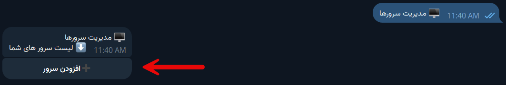
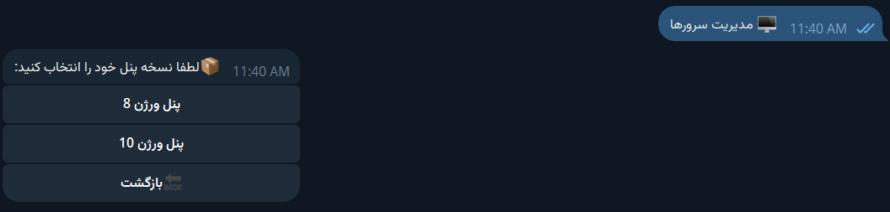
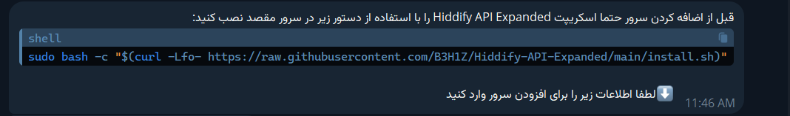
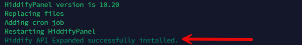
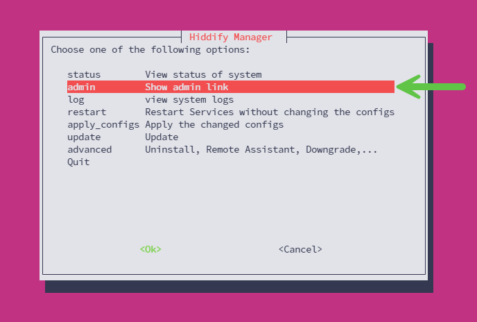
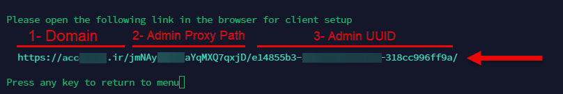
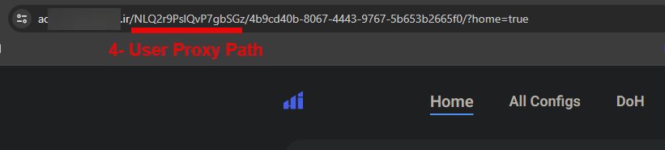
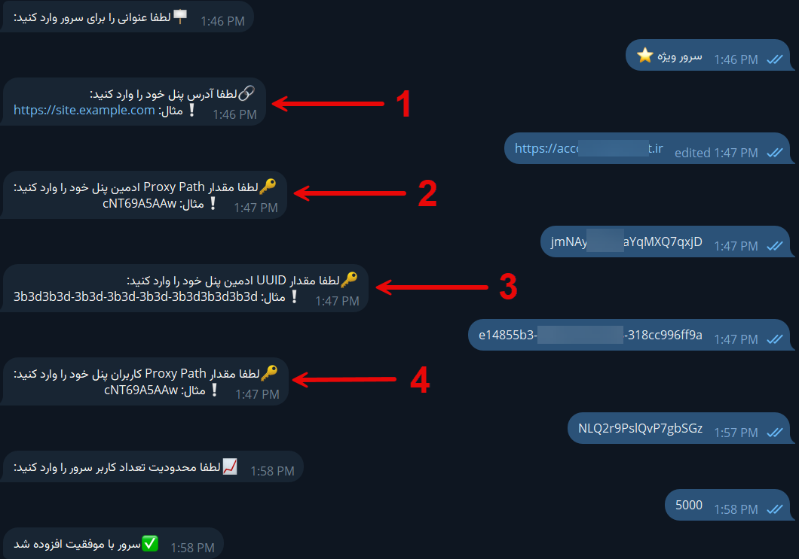

<head>
    <meta charset="utf-8">
    <link rel="stylesheet" href="style.css">
</head>

<h3>آموزش افزودن سرور</h3>
 
<b>راه‌اندازی اولیه:</b>

پس از راه‌اندازی اولیه ربات، شما نیاز به افزودن سرور خود دارید. جهت افزودن سرور ابتدا در ربات مدیریت از قسمت "مدیریت سرور" بر روی دکمه "افزودن سرور" کلیک کنید. .

حالا ورژن پنل خود را از لیست نمایشی انتخاب کنید

 
<b>نصب اسکریپت Hiddify API Expanded:</b>

قبل از افزودن سرور نیاز است که اسکریپت Hiddify API Expanded را روی سرور خود نصب کنید. لازم به ذکر است تایید سرور توسط ربات و عملیات‌ها وابسته به نصب این اسکریپت می‌باشد، بنابراین نصب آن اجباری می‌باشد.

<b>دستور نصب:</b>

<code>sudo bash -c "$(curl -Lfo- https://raw.githubusercontent.com/B3H1Z/Hiddify-API-Expanded/main/install.sh)"</code>
 

پس از وارد کردن دستور در سرور پنل، مقداری صبر کنید تا در نهایت با پیام نصب موفقیت‌آمیز مواجه شوید.

 
<b>وارد کردن اطلاعات مورد نیاز:</b>

مواردی که نیاز است برای افزودن سرور وارد کنید:

<ul>
    <li><strong>عنوان سرور</strong></li>
    <li><strong>دامنه پنل</strong></li>
    <li><strong>مقدار Proxy Path ادمین</strong></li>
    <li><strong>مقدار UUID ادمین</strong></li>
    <li><strong>مقدار Proxy Path کاربران</strong></li>
    <li><strong>ظرفیت سرور</strong></li>
</ul>

جهت دریافت مقادیر دامنه، Proxy Path ادمین و UUID ادمین بایستی وارد سرور خود شوید، سپس در منوی هیدیفای گزینه admin را انتخاب کنید. پس از ورود به منوی admin، آدرس پنل شما قابل مشاهده است.

آدرس پنل شما متشکل از 3 بخش است که با علامت اسلش از هم جدا شده و در تصویر فوق علامت گذاری شده که کدام مقدار را برای اطلاعات مورد نیاز ربات وارد کنید

<ul>
    <li><strong>دامنه سرور</strong></li>
    <li><strong>مقدار Proxy Path ادمین</strong></li>
    <li><strong>مقدار UUID ادمین</strong></li>
</ul>

حال ربات از شما درخواست مقدار Proxy Path کاربران را می‌کند. جهت دریافت این مقدار به صفحه شخصی یکی از اشتراک‌های ایجاد شده در پنل خود بروید، سپس بخش ذکر شده در تصویر را برای مقدار Proxy Path کاربران در ربات وارد کنید.

در نهایت، ربات از شما مقداری جهت اعمال محدودیت در تعداد کاربران سرور می‌خواهد. این مقدار به این منظور است که ربات به صورت خودکار پس از رسیدن تعداد کاربران پنل شما به آن تعداد، اجازه خرید اشتراک جدید را ندهد.

 
<b>نکات مهم:</b>
<ul>
    <li><strong>مقدار Admin UUID حتما باید دارای سطح دسترسی Super Admin باشد.</strong></li>
    <li><strong>آدرس دامنه وارد شده باید مستقیم باشد و به هیچ عنوان دامنه cdn شده وارد نکنید.</strong></li>
</ul>

 
<b>اتمام عملیات:</b>

پس از آنکه با پیام موفقیت‌آمیز بودن افزودن سرور مواجه شدید، می‌توانید با زدن دکمه "مدیریت سرور" سرور اضافه شده را با عنوانی که تعیین کردید ببینید.

