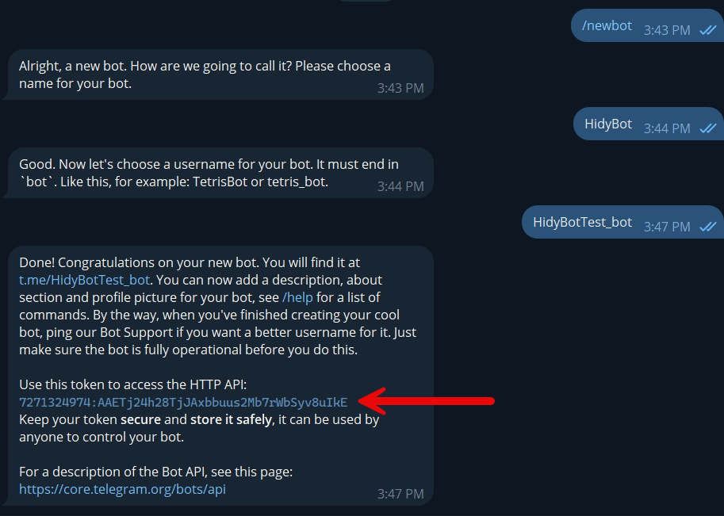

<head>
    <meta charset="utf-8">
    <link rel="stylesheet" href="style.css">
</head>

<h3>آموزش ساخت ربات و دریافت توکن</h3>
 
<b>جهت ساخت ربات و دریافت توکن آن بایستی از طریق ربات BotFather اقدام کنید</b>

<ul>
    <li>دستور /start را ارسال کنید</li>
    <li>دستور /newbot را وارد کنید</li>
    <li>یک نام دلخواه برای ربات خود انتخاب کنید</li>
    <li>
    یک نام کاربری برای ربات خود تعیین کنید که با کلمه bot به پایان برسد
     
    (مثال bestshopbot یا bestshop_bot)
    </li>
</ul>
 

 

حالا ربات شما ساخته شده. توکن ربات جدید شما در پیام دریافتی موجود است.

