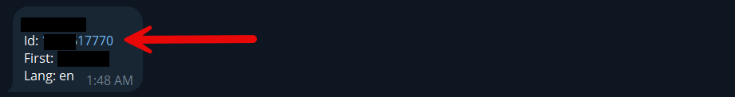

<head>
    <meta charset="utf-8">
    <link rel="stylesheet" href="style.css">
</head>

<h3>آموزش دریافت آیدی عددی</h3>
 
<b>جهت دریافت آیدی عددی آن بایستی از طریق ربات userinfobot اقدام کنید</b>

<ul>
    <li>دستور /start را برای ربات ارسال کنید</li>
</ul>

در پیام دریافتی مقدار عددی دریافتی آیدی عددی شما در مقابل کلمه Id قابل مشاهده میباشد.

