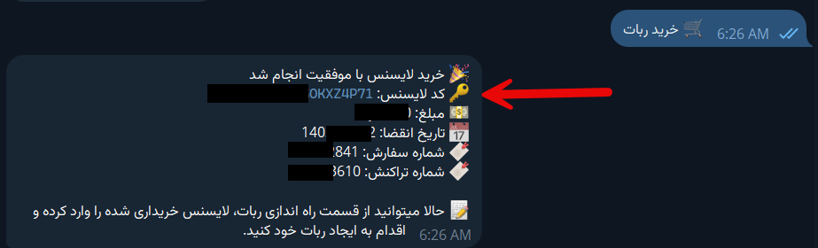
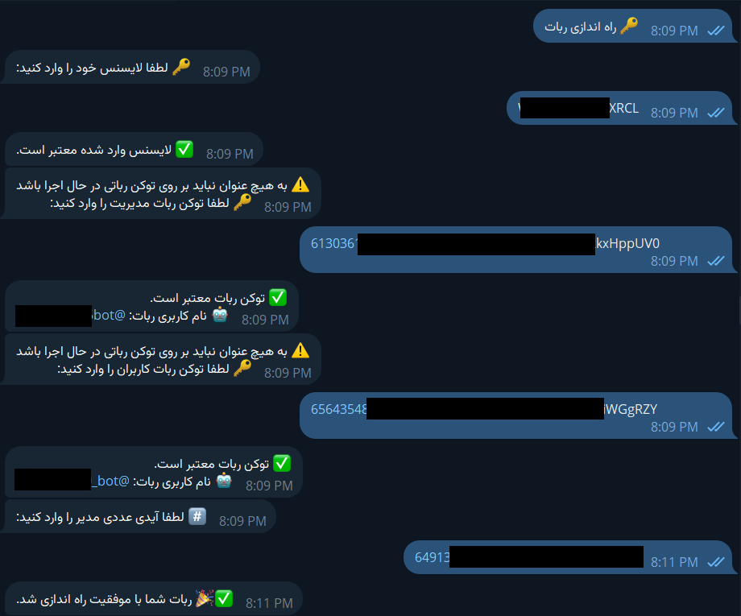

<head>
    <meta charset="utf-8">
    <link rel="stylesheet" href="style.css">
</head>

    <h3>برای راه‌اندازی و مدیریت ربات تلگرام با استفاده از لایسنس خریداری شده، مراحل زیر را دنبال کنید</h3>
     
    <b>خرید لایسنس:</b>
    
ابتدا وارد ربات مدیریت لایسنس شوید و با استفاده از دکمه "خرید ربات"، لایسنس خود را خریداری کنید.

     
    
    
     
    <b>راه‌اندازی ربات:</b>
    
روی دکمه "راه‌اندازی ربات" کلیک کرده و کد لایسنس خریداری شده را وارد کنید.

     
    <b>وارد کردن اطلاعات مورد نیاز:</b>
    
پس از وارد کردن کد لایسنس، ربات از شما اطلاعات زیر را درخواست می‌کند:

    <ul>
        <li><strong>توکن ربات مدیریت (ادمین):</strong> 
        مثال: ABCdEfGhIjKlMnOpQrStUvWxYz1234567890</li>

        <li><strong>توکن ربات کاربران:</strong> 
        مثال: ABCdEfGhIjKlMnOpQrStUvWxYz1234567890</li>
        
        <li><strong>آیدی عددی مدیر یا مدیران:</strong> 
        مثال: 123456789 
        در صورتی که ربات شما دارای چندین مدیر می‌باشد می‌توانید آیدی عددی آنها را مانند مثال زیر جدا کنید. 
        مثال: 123456789,12131415</li>
    </ul>

    
     
    <b>اتمام عملیات:</b>
    
پس از وارد کردن اطلاعات و مشاهده پیام موفقیت‌آمیز بودن عملیات، ربات شما با موفقیت راه‌اندازی شده است.

